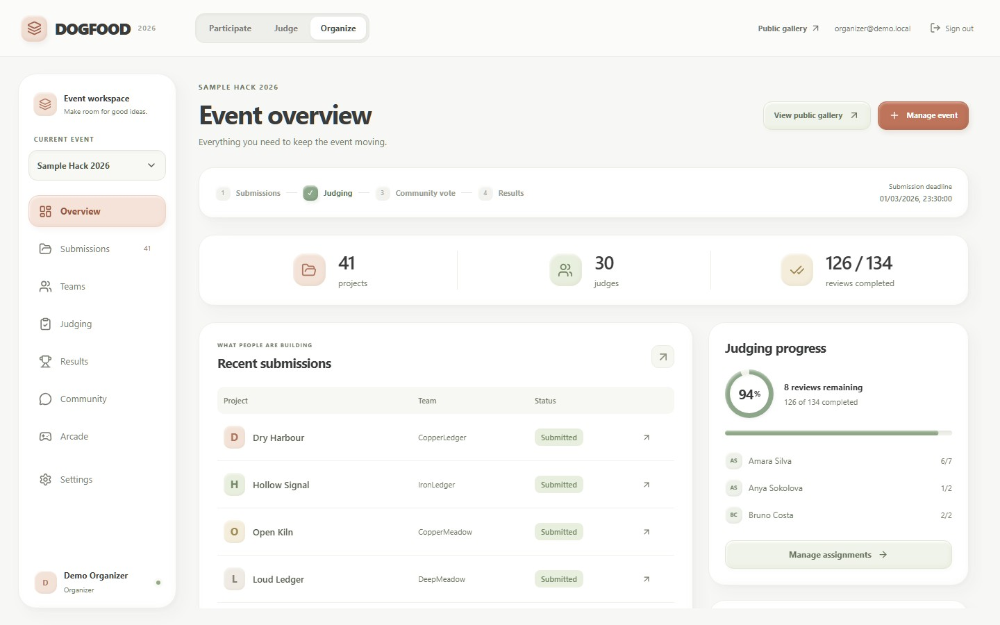

# DOGFOOD 2026

**A self-hosted portal for running a hackathon from registration to published results.** Teams submit projects, judges score them against a weighted rubric, organizers monitor progress, and the public can browse projects and vote when the event permits it. Event data lives in SQLite. The interface is built with Next.js 16 and the API uses the Python standard library.



[Watch the 4:59 submission video](docs/submission-demo.mp4) · [Read the timed voiceover](docs/submission-voiceover.md) · [Testing results](TESTING.md) · [API documentation](API.md)

The project claims **T1, T2, T3 and T4**. The published DOGFOOD checker verifies seven T1/T2 behaviors; it contains no T3/T4 probes. [Our tier evidence](TIER-EVIDENCE.md) and [supplementary regression receipt](tier-regression-report.txt) document the higher-tier workflows without presenting them as organizer-verified.

## Start in one command

From the repository root, with Docker and Compose installed and the Docker engine running:

```bash
docker compose up --build --wait
```

Open **http://localhost:8000/**. The portal seeds itself with the official `fixtures.json` and three interactive demo events. Compose runs Next and the Python API, and retains SQLite data in the named `portal_data` volume. Set `DOGFOOD_PORT` if port 8000 is occupied. The first build needs the base images and npm packages available; once built, the portal has no hosted runtime dependency.

Stop the services with `docker compose stop`; starting them again preserves their data. Once the images exist locally, start without downloading or rebuilding:

```bash
docker compose up --no-build --pull never --wait
```

Offline startup, local images/video and data persistence were verified on an internal-only Docker network. See the [dated Docker verification](docs/docker-verification-2026-09-28.md) for the tested revision, image IDs and receipts.

### Local development without Docker

Use Node.js 22 and Python 3.11 or newer. The API uses only the Python standard library. Install JavaScript dependencies once:

```bash
npm ci
```

Then run these in separate terminals from the repository root:

```powershell
$env:HOST='127.0.0.1'; $env:PORT='8000'; python src/dogfood.py
```

```powershell
npm run dev
```

Open **http://localhost:3000/**. Next forwards API, gallery, invitation, embed and verification routes to Python. `/health` reports API readiness. To use a separate local database, set `DOGFOOD_DB` to its path before starting Python.

## Try the full lifecycle

For a shared native preview account, put its `email` and `password` in the ignored `data/demo-login.json` file, then restart the Python API. The seeded account can open the Organizer, Judge, and Participant workspaces and has an open judge assignment. This account is disabled when `DOGFOOD_DEMO_MODE=0` or the local settings file is absent. Changing workspace tabs never changes the signed-in account.

The original seeded accounts remain available with password **`dogfood-demo-2026`** for role-specific walkthroughs and acceptance checks. Use the Organizer, Judge or Participant demo buttons, or sign in explicitly:

| Account | Role |
| --- | --- |
| `organizer@demo.local` | Organizer |
| `participant@demo.local` | Participant |
| `marek.nowak@example.org` | Judge A |
| `priya.nair@example.org` | Judge B |

| Event | Intended walkthrough |
| --- | --- |
| `evt_demo` | Form a team, save a draft, and submit a project before the deadline. |
| `evt_review_demo` | Sign in as a judge and complete an assigned review. |
| `evt_vote_demo` | Open a randomized ballot, vote, comment, and inspect moderation as an organizer. |
| `evt_01` | Inspect the historical official fixture: 41 project rows, 30 judges, unfinished reviews and a duplicate. Its submission deadline is closed. |

The fixture also contains 8 tracks, 40 teams and 126 reviews. Its original deadline, `2026-03-01T18:00:00Z`, is preserved. Use the interactive demo events or create a separate event for new submissions.

An organizer can create a separate event, configure tracks, prizes, dates and custom questions, invite participants and judges, assign review batches, publish a frozen result snapshot, and export the event. See [DEMO.md](DEMO.md) for a guided walkthrough.

## Four-tier status

| Tier | Implemented behavior | Reproducible result |
| --- | --- | --- |
| **T1 Core** | Sessions and roles; event setup; team invites; editable drafts and enforced deadlines; searchable public gallery. | Published checker **3/3 PASS**. |
| **T2 Judging** | Judge invites and track-scoped assignments; weighted, versioned rubric; private reviews; progress; documented cross-judge normalization; CSV. | Published checker **4/4 PASS**. |
| **T3 Public** | Authenticated or email-bound invitation voting; comments and moderation; hidden results during voting; shuffled ballots; duplicate/self-vote controls, rate limits and organizer audit. | Supplementary API regressions **2/2 PASS**; manual organizer review remains necessary. |
| **T4 Stretch** | Documented REST API and signed webhooks; project certificates and judge records with public server verification; embeddable gallery; full JSON archive import/export. | Supplementary API regressions **4/4 PASS**; manual organizer review remains necessary. |

The unmodified [acceptance report](acceptance-report.txt) says `verified T1 T2` and `claimed but not verified: T3 T4` because the organizer's `run.py` only contains T1/T2 probes. The [tier evidence map](TIER-EVIDENCE.md) names the API paths, test methods and limits for T3/T4. [TESTING.md](TESTING.md) records Docker, offline, fixture, browser and persistence checks from the repository's verification runs.

## How the data and API work

- **Shared state:** Python owns authorization, deadlines, event lifecycle and a SQLite database. The browser does not decide who may judge, vote or export.
- **Official fixture:** Startup imports the 40 teams, 41 submission rows and 126 reviews with stable IDs. The duplicate stays visible but is excluded from scoring; unfinished reviews remain unfinished. Restarting does not duplicate fixture rows.
- **Judging:** Reviews stay private to their judge and organizers. The [judging method](JUDGING.md) and [normalization proof](NORMALIZATION.md) explain weighted scores, judge-mean shrinkage and the fixture ranking changes. Publication freezes result snapshots.
- **Community:** Organizers choose authenticated or invitation-only voting. Invitations are single-use, email-bound links that organizers distribute themselves. Public tallies remain hidden until publication.
- **Portability:** Organizer JSON export contains the full event history, including roles, rubric versions, assignments, reviews, votes, comments, audit entries and published results. Import into a **new empty event** remaps IDs and matches accounts by email. Unknown historical accounts remain locked until their owners accept an organizer invitation. Passwords, sessions, signing keys and webhook secrets do not travel in archives. A smaller team/project import and CSV results export are also available.
- **Integrations:** [API.md](API.md) describes the REST endpoints and HMAC-signed webhooks; the live OpenAPI document is at `/dogfood-api/openapi.json`. Published project certificates and judge participation records have public verification URLs served by the issuing portal. `/embed/events/{id}` provides an iframe gallery.
- **Arcade:** Six games are available in the workspace. Their high scores belong to the current browser and have no effect on event results.

## Run the checks

With the seeded portal running on the default Compose port and Python 3.11 or newer installed on your host:

```bash
python scripts/check_acceptance.py
python -B scripts/check_upper_tiers.py
python -B scripts/verify_host_fixtures.py
python -B -m unittest discover -s tests -v
node --test tests/local-store.test.mjs tests/openapi.test.mjs
python -B scripts/normalization_report.py --check
npm run build
```

For local development on port 3000, add `--base-url http://127.0.0.1:3000` to `check_acceptance.py` and `verify_host_fixtures.py`; the same option supports an alternate Docker port. `check_acceptance.py` runs the **unmodified** published `run.py`, saves its exact output to `acceptance-report.txt` and exits nonzero if any of its seven probes fail. `check_upper_tiers.py` runs project-owned T3/T4 tests against an isolated temporary database and writes `tier-regression-report.txt`; it is not an organizer acceptance suite.

For browser regressions, install dependencies with `npm ci` and install Chromium once, then run:

```bash
npx playwright install chromium
npx playwright test
```

By default, Playwright starts isolated local services and a temporary database. To test a running Docker demo/test instance, set `DOGFOOD_TEST_URL` to its URL. Browser tests create real accounts and events in their target database.

The [28 September verification](docs/docker-verification-2026-09-28.md) recorded 25 browser tests, 21 containerized API tests, normal and offline 7/7 host checks, full fixture/score comparisons, local media delivery and restart persistence. That report identifies its tested revision; the separate upper-tier receipt documents the later tier claims. [TESTING.md](TESTING.md) contains the detailed commands and coverage, and the [official fixture report](docs/host-fixture-verification-2026-09-28.md) includes downloaded file hashes.

## Demo recordings

- [Submission video — MP4](docs/submission-demo.mp4): a 4:59 silent edit of real portal screen recordings covering event setup, submissions, judging, voting, moderation, records, export, and public results. [Timed voiceover script](docs/submission-voiceover.md) is ready to record. Its opening and [Community footage](docs/community-demo.mp4) show the current interface; the detailed lifecycle recording shows the earlier interface.
- [Current clay UI walkthrough — MP4](public/landing/demo.mp4): a 36.4-second recording of the actual app, embedded on the landing page at `/#watch-demo`.
- [Earlier five-minute lifecycle recording — WebM](docs/demo.webm): preserved for reference; it shows the preceding interface.
- [DEMO.md](DEMO.md): scene timings, video checks and recording instructions.

## Running your own event

Turn off demo accounts, set a private organizer identity and start with a fresh Compose project and data volume:

```powershell
$env:DOGFOOD_DEMO_MODE='0'
$env:DOGFOOD_ADMIN_EMAIL='you@example.org'
$env:DOGFOOD_ADMIN_PASSWORD='choose-at-least-12-characters'
docker compose -p dogfood-event up --build --wait
```

Back up the SQLite volume, protect organizer credentials and webhook secrets, and review event audit entries. Demo tokens and the demo password are for the seeded instance only.

Use an unused project name for a fresh Docker volume. For the native API, use a new `DOGFOOD_DB` path instead. Disabling demo mode does not remove accounts from an existing database.

## Limits and design decisions

Invitation-only voting narrows access to organizer-approved links but does not prove one person has only one account; links must be delivered through a trusted channel. There is no automatic email service or account recovery. Webhook delivery is synchronous and retryable, without a background worker. Signed records are publicly verified **by this server**, not independently offline with a public key. Pairwise judging is not implemented. Arcade scores remain browser-local. An initial Docker image build needs cached dependencies or internet; the built runtime does not.

These boundaries, abuse controls and remaining risks are detailed in [THREAT-MODEL.md](THREAT-MODEL.md) and [ARCHITECTURE.md](ARCHITECTURE.md). [DATA-MODEL.md](DATA-MODEL.md) describes the schema and archive format. The project is released under the [MIT license](LICENSE).
